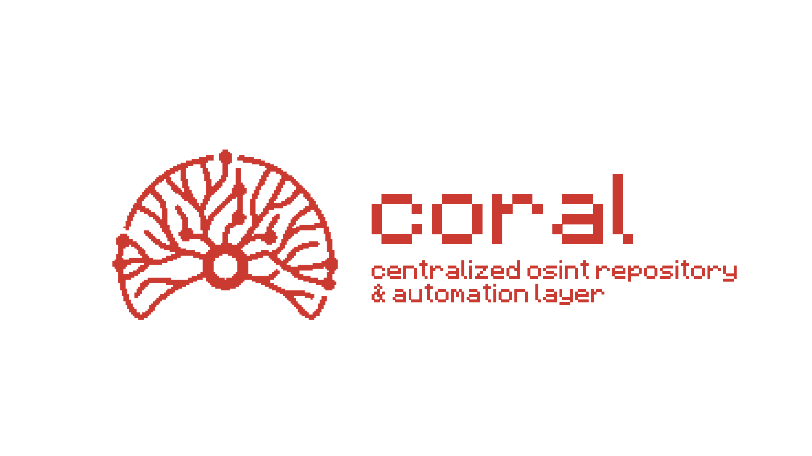

<div align="center">
  
  
  # CORAL - Centralised OSINT Repository and Automation Layer
  
  <p>A flexible monitoring dashboard that consolidates multiple OSINT tools (Instagram, Pinterest, Spotify) into a single interface - or run each tool independently.</p>
  
  [](LICENSE)
  [](https://www.python.org/downloads/)
  
</div>

---

## Quick Start

```bash
./start_all.sh                    # Start everything
./start_monitor.sh instagram      # Start one monitor
./start_monitors_only.sh          # All monitors, no hub
```

Open http://localhost:5002 for the unified dashboard.

## Features

- **Unified Dashboard** - Monitor all platforms in one place
- **Auto-Detection** - Monitors auto-detect CORAL (<500ms)
- **Standalone Mode** - Use each tool independently
- **Central Config** - One `config.yaml` for everything
- **Manual Triggers** - Check all platforms instantly
- **Person Linking** - Link profiles across platforms
- **Dark Theme** - Beautiful responsive UI

## Installation

```bash
# Install dependencies
cd coral
pip3 install -r requirements.txt
cd ..

# Configure
nano config.yaml  # Edit settings

# Start
./start_all.sh
```

## Configuration

Edit `config.yaml`:

```yaml
coral:
  enabled: true
  port: 5002

instagram:
  enabled: true
  port: 8000
  webhook:
    enabled: true

pinterest:
  enabled: true
  port: 5001

spotify:
  enabled: true
  port: 8001
```

### Common Configurations

**Run standalone Instagram only:**
```yaml
coral.enabled: false
instagram.enabled: true
instagram.standalone: true
pinterest.enabled: false
spotify.enabled: false
```

**Run all monitors independently:**
```yaml
coral.enabled: false
instagram.standalone: true
pinterest.standalone: true
spotify.standalone: true
```

**Full integrated system:**
```yaml
coral.enabled: true
# All webhooks enabled by default
```

### Change Ports

```yaml
coral:
  port: 6000  # Change from 5002

instagram:
  port: 9000  # Change from 8000
```

Then update database:
```bash
cd coral && python3 update_config.py && cd ..
./start_all.sh
```

## Usage Modes

### Integrated Mode (Hub + Monitors)
```bash
./start_all.sh
```
- Unified dashboard at http://localhost:5002
- Manual trigger buttons
- Person linking across platforms
- Timeline view of all events

### Standalone Mode (Independent Monitors)
```bash
./start_monitor.sh instagram  # Just Instagram
./start_monitor.sh pinterest  # Just Pinterest  
./start_monitor.sh spotify    # Just Spotify
```
- Zero dependencies on hub
- Original functionality preserved
- Works if hub is down

### Mixed Mode (All Monitors, No Hub)
```bash
./start_monitors_only.sh
```
- All monitors active
- No central dashboard
- Independent databases

## Manual Triggers

### From Web UI
1. Open http://localhost:5002
2. Go to Settings tab
3. Click "Trigger" button for any platform
4. Or click "Trigger All Checks" on main page

### From Command Line
```bash
# Trigger all
curl -X POST http://localhost:5002/api/trigger

# Trigger specific platform
curl -X POST http://localhost:8000/api/check-now  # Instagram
curl -X POST http://localhost:5001/api/check-now  # Pinterest
curl -X POST http://localhost:8001/api/check-now  # Spotify
```

### Configure Trigger URLs

Edit `config.yaml`:
```yaml
instagram:
  trigger_url: "http://localhost:8000/api/check-now"
  
pinterest:
  trigger_url: "http://localhost:5001/api/check-now"
  
spotify:
  trigger_url: "http://localhost:8001/api/check-now"
```

## Auto-Detection

Monitors automatically detect if CORAL is available:

```python
from coral_checker import should_use_coral

# Fast check (<500ms timeout)
use_hub, message = should_use_coral()

if use_hub:
    print("INTEGRATED mode - sending to CORAL")
else:
    print("STANDALONE mode - working independently")
```

Test it:
```bash
python3 demo_auto_detection.py  # See auto-detection in action
```

## Person Management

Link multiple platform profiles to track one person:

1. Create a person: "John Doe"
2. Link profiles:
   - Instagram: @johndoe
   - Pinterest: @john_doe_pins
   - Spotify: John Doe
3. See all their activity in one view

## 📁 Project Structure

```
coral/
├── config.yaml                  # Central configuration
├── start_all.sh                 # Start everything
├── start_monitor.sh             # Start one monitor
├── start_monitors_only.sh       # Monitors only
├── demo_auto_detection.py       # Demo auto-detection
│
├── coral/                     # Hub Dashboard
│   ├── app.py                   # Flask app
│   ├── database.py              # SQLite DB
│   ├── coral_notifier.py      # Integration helper
│   └── templates/index.html     # Web UI
│
├── instagram_monitor/           # Instagram OSINT
├── pinterest_monitor/           # Pinterest OSINT
└── spotify_monitor/             # Spotify OSINT
```

## 📊 API Endpoints

### Hub API
- `GET /api/stats` - System statistics
- `GET /api/persons` - List persons
- `POST /api/persons` - Create person
- `GET /api/events` - List events
- `POST /api/webhook/{platform}` - Receive events
- `POST /api/trigger` - Trigger all checks
- `POST /api/platforms/{id}/trigger` - Trigger one platform

### Monitor APIs
Each monitor exposes:
- `POST /api/check-now` - Trigger check
- Platform-specific endpoints

## 🛑 Stop Services

Find and stop running services:
```bash
lsof -ti:5002,5001,8000,8001
```

Then stop each PID individually:
```bash
kill 12345  # Replace with actual PID
```

## 📝 Requirements

- Python 3.7+
- Flask 3.0.0
- requests 2.31.0
- python-dateutil 2.8.2
- pyyaml 6.0+

## 🔌 Integrate Your Own Tool

See [AI_AGENT_INTEGRATION.md](AI_AGENT_INTEGRATION.md) for detailed guide on integrating new platforms using AI assistants.

Quick integration:
```python
from coral.coral_notifier import CORALNotifier

# Auto-detects CORAL availability
notifier = CORALNotifier('myplatform')

# Send events (gracefully fails in standalone mode)
notifier.send_event(
    username='johndoe',
    event_type='new_post',
    summary='New post detected',
    data={'post_id': '123'}
)
```

## Use Cases

**Security Researcher**: Monitor multiple social profiles  
**OSINT Investigator**: Track target across platforms  
**Brand Monitor**: Watch for mentions/activity  
**Developer**: Build custom OSINT tools with shared UI  

## 📚 Documentation

- **[STANDALONE_USAGE.md](STANDALONE_USAGE.md)** - Run monitors independently
- **[AI_AGENT_INTEGRATION.md](AI_AGENT_INTEGRATION.md)** - Integrate new platforms
- **[CONTRIBUTING.md](CONTRIBUTING.md)** - Contribution guide
- **LICENSE** - MIT License

## Key Benefits

**Flexible** - Use with or without hub  
**Fast** - Auto-detection <500ms  
**Independent** - Each tool works standalone  
**Extensible** - Easy to add platforms  
**Well Documented** - Comprehensive guides  

## License

MIT License - See [LICENSE](LICENSE)

## 🤝 Contributing

See [CONTRIBUTING.md](CONTRIBUTING.md) for guidelines.

---

**Get Started**: `./start_all.sh` → http://localhost:5002

## 📱 Example Monitors

CORAL works with any OSINT tool. Here are some standalone examples that can optionally integrate:

- **[Instagram Monitor](https://github.com/YOUR_USERNAME/instagram_monitor)** - Track Instagram user activities and profile changes
- **[Pinterest Monitor](https://github.com/YOUR_USERNAME/pinterest_monitor)** - Monitor Pinterest boards for new pins and activity
- **[Spotify Monitor](https://github.com/YOUR_USERNAME/spotify_monitor)** - Track Spotify friend activity and profile changes

Each monitor works completely standalone. CORAL integration is optional and adds unified dashboard functionality.

## 🔗 Adding Your Own Monitor

See [ADDING_NEW_MONITORS.md](ADDING_NEW_MONITORS.md) for a complete guide on integrating new OSINT tools with CORAL.
